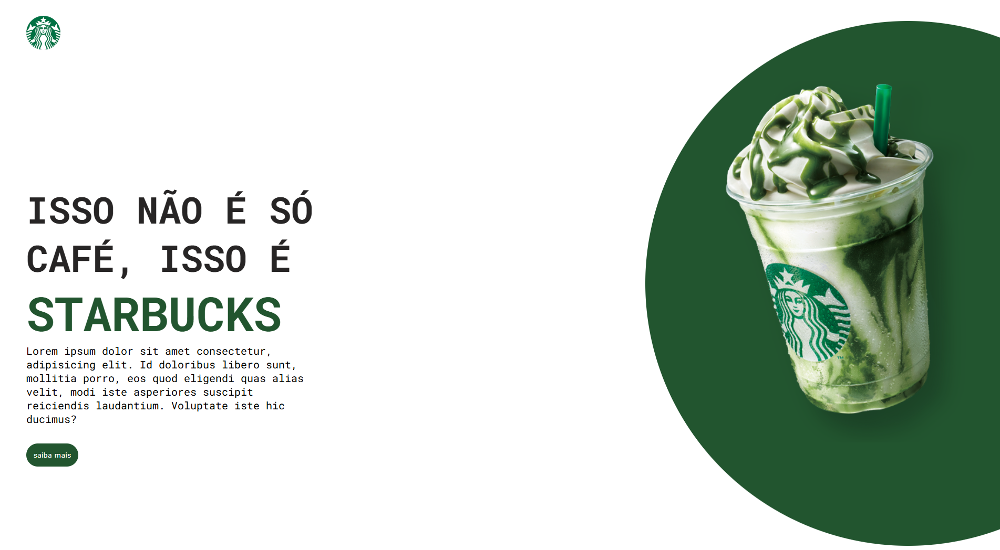
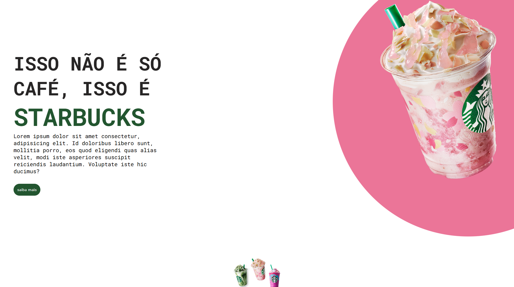
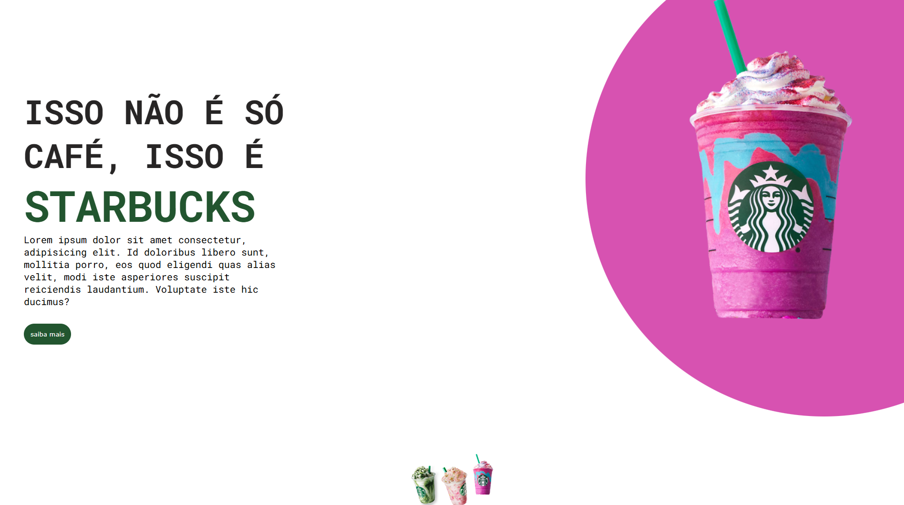

# ☕ Starbucks | Missão Programação do Zero

Projeto desenvolvido como parte do curso *"Missão Programação do Zero"* com Rodolfo Mori, com o objetivo de criar um site completo e responsivo da Starbucks utilizando HTML, CSS e JavaScript.

---

## 📌 Sobre o projeto
Este projeto foi uma imersão prática para entender como HTML, CSS e JavaScript trabalham juntos para criar interfaces bonitas, funcionais e interativas.

- HTML: o esqueleto, responsável por estruturar todo o conteúdo.  
- CSS: a pele e o estilo, trazendo um visual moderno, clean e responsivo.  
- JavaScript: o cérebro, adicionando interatividade, animações e funcionalidades dinâmicas.

---

## 🎯 Objetivo
Reproduzir uma landing page da Starbucks, aplicando conceitos fundamentais de front-end e boas práticas de desenvolvimento.

---

## 🚀 Tecnologias utilizadas
- HTML5
- CSS3

---

## 📸 Prévia do projeto
  

---

## 👤 Autor

Feito com dedicação por [Kevin Soares](https://github.com/KevinSoaresFC)

